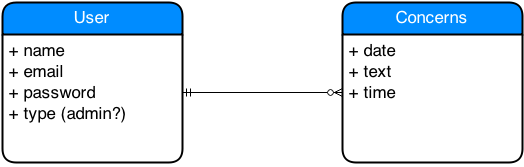

#SpeakUp

### GA WDI DC August 2014, Project 1

###Overview
**SpeakUp** is an app that facilitates students' reporting of school bullying concerns and incidents and their school counselors and administrators' responsive, in an effort to systematically combat bullying in the context of schools. SpeakUp was built with the mindset that bullying is harmful and injurious not only to those involved in a particular incident, but to all those in that given community, as it erodes the trust and good faith necessary to create and sustain a positive setting for learning, what every school ought to be. SpeakUp was developed as a sample Rails project for the August 2014 Web Development Immersive course at General Assembly.

###Technologies Used
* Ruby 2.1.1
* Ruby on Rails 4.1.1
* PostgreSQL Database
* Devise gem for authentication and authorization
* Custom styling with CSS3 and HTML5

###User Stories Completed
* As a user I can: 
  * sign up for an account
  * sign into/out of my account
  * submit a concern
  * edit a concern
  * delete a concern
  * view my immediate concern
  * view all of my concerns
* As the administrator I can:
  * do everything non-admin users can do, plus
  * view all users' concerns
  * view all users' emails 
  * see which concerns belong to whom based on contact information
  * contact users via email and respond to their concerns

###ERD 

###Local Setup
    rake db:create
    bundle install
    rake db:migrate
    rake db:seed
    rails s

    Open the page locally on http://localhost:3000.

---
######Written by Lisa Snider